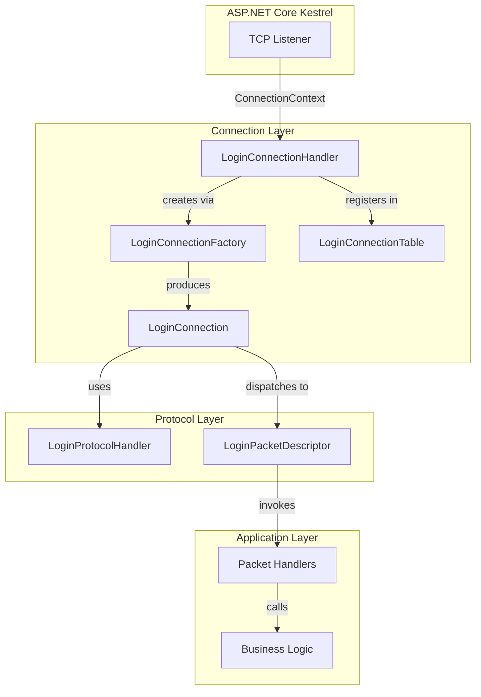
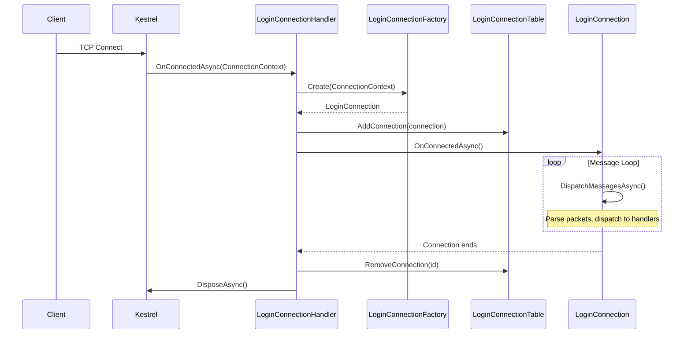
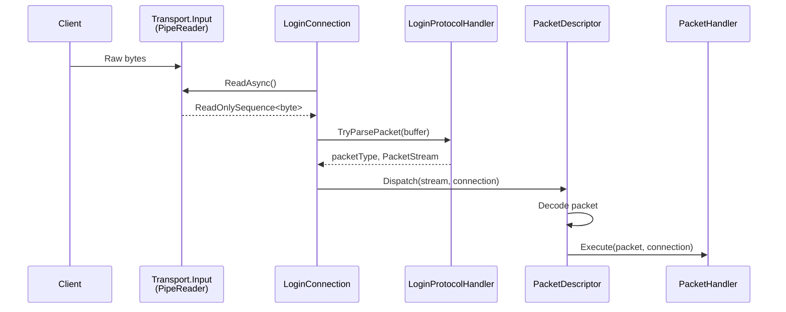

# Login Server Networking

This document describes the networking architecture for client connections to the login server, which uses ASP.NET Core Kestrel for raw TCP handling.

## Architecture Overview

The login server uses Kestrel configured for raw TCP connections (not HTTP). When a client connects, the connection flows through several layers before reaching application logic:



### Key Components

| Component | Responsibility |
|-----------|----------------|
| `LoginConnectionHandler` | Kestrel entry point; receives raw TCP connections |
| `LoginConnectionFactory` | Creates `LoginConnection` instances with required dependencies |
| `LoginConnection` | Per-connection state; owns the message dispatch loop |
| `LoginConnectionTable` | Thread-safe registry of active connections |
| `LoginProtocolHandler` | Parses binary packet format from byte streams |
| `LoginPacketDescriptor` | Maps packet type IDs to handlers; deserializes and dispatches |

## Connection Lifecycle

When a client connects, the following sequence occurs:



### Startup Configuration

Kestrel is configured in `Program.cs` to listen for raw TCP connections:

```csharp
builder.WebHost.ConfigureKestrel((context, options) =>
{
    options.Listen(address, port,
        opts => opts.UseConnectionHandler<LoginConnectionHandler>());
});
```

The `UseConnectionHandler<T>()` method registers a custom `ConnectionHandler` that receives raw TCP connections instead of HTTP requests.

### Service Registration

Networking services are registered via the `AddLoginNetwork()` extension method, which sets up:

- `ILoginProtocolHandler` - Packet parsing
- `ILoginConnectionTable` - Connection registry
- `ILoginConnectionFactory` - Connection creation
- `IConnectionIdLeaseFactory` - Connection ID pooling

## Packet Flow

### Inbound (Client to Server)



The message dispatch loop in `LoginConnection.DispatchMessagesAsync()` continuously reads from the transport, parses complete packets, and dispatches them to the appropriate handler.

### Outbound (Server to Client)

Sending packets is straightforward - encode the packet and write to the transport output.

A `SemaphoreSlim` serializes writes to prevent interleaved packet data when multiple tasks send concurrently.

## Binary Packet Format

Packets use a simple length-prefixed binary format (little-endian):

```
┌─────────────────────────────────────┐
│ Length (ushort, 2 bytes)            │  Size of Type + Data
├─────────────────────────────────────┤
│ Type (ushort, 2 bytes)              │  Packet type identifier
├─────────────────────────────────────┤
│ Data (variable)                     │  Packet payload
└─────────────────────────────────────┘
```

The `LoginProtocolHandler.TryParsePacket()` method handles partial reads - if a complete packet isn't available, it returns `false` and waits for more data.

## Error Handling and Shutdown

### Expected vs Unexpected Disconnects

The connection distinguishes between normal disconnects and actual errors.

Expected disconnects (client closed connection, connection reset) are handled silently. Unexpected errors are logged.

### Connection Cleanup

When a connection ends (normally or due to error), cleanup occurs in this order:

1. `LoginConnection.Shutdown()` - Aborts the connection if not already closed
2. `LoginConnectionTable.RemoveConnection()` - Removes from the active connection registry
3. `ConnectionContext.DisposeAsync()` - Releases Kestrel resources
4. `LoginConnection.DisposeAsync()` - Releases the write lock and returns the connection ID to the pool

### Graceful Shutdown

The `ConnectionClosed` cancellation token on `LoginConnection` can be used to detect when the connection is closing, allowing handlers to clean up gracefully.

## File Reference

Key files for the networking implementation:

| File | Purpose |
|------|---------|
| `Core/Network/Login/LoginConnectionHandler.cs` | Kestrel connection entry point |
| `Core/Network/Login/LoginConnectionFactory.cs` | Creates connection instances |
| `Core/Network/Login/LoginProtocolHandler.cs` | Binary packet parsing |
| `Core/Network/Login/LoginPacketDescriptor.cs` | Packet type to handler mapping |
| `Core/Network/Login/ServiceCollectionExtensions.cs` | DI registration |
| `Core/Network/Connections/LoginConnection.cs` | Per-connection state and dispatch loop |
| `Core/Network/Connections/LoginConnectionTable.cs` | Active connection registry |
