### Understanding AAEmu Components

Its important to understand AAEmu compontents to be able to setup your own server and start playing with it and contribute to the project.

#### Database Components

##### Archeage Reference Database (Sqlite - ReadOnly)

This is the original Archeage database, contains the majority of references, loot tables, configurations related to the all components in the Archeage world. This database is readonly and is used to read all the original game data and start the server on its initial state.

##### Archeage State Database (MySQL - Read/Write)

This is the database that contains all the state changes made in Archeage world.

Support changes like:

-   Player Characters (Level, Skills, Experience, Quests, Labor points, etc)
-   Housing information
-   Items acquired (Inventory, Bank, etc)

This database is composes of two schemas:

1. `aaemu_game`: All the state changes made to the Archeage world,
1. `aaemu_login`: All data related to login/account of the players.

#### Application Components

##### Login Server

This is the server that handles the login process from both archeage clients and game server.

This server uses the `Archeage State Database` to check the account and load characters information to be used by the Game Client in the login process.

##### Game Server

This is the main application of the project and that handles all ingame server process.

This server uses both `Archeage References Database` and `Archeage State Database` to be loaded and keeping the state of the world.

##### Game Launcher

This is an application that start the Archeage Client targeting the specific Emulated Login Server.

##### Archeage Client

This is the Archeage Game Client used to play and connect to the **AAEmu**lated Game Server.

**Version 1.2** is the version of the client this project is mainly designed to work for,
**Other versions have varying, but generally less, support**

#### How components interact

```mermaid
sequenceDiagram
    actor You
    participant Login as ArcheAge-LoginServer
    participant G as ArcheAge-GameServer
    participant L as ArcheAge-Launcher
    participant C as ArcheAge-Client

    You -->> Login : Start
    activate Login

    You -->> G : Start
    activate G

    G ->> Login : Connect
    You -->> L : Start
    activate L
    L -->> Login : Connect (Check server is online, Play button enabled)
    You -->> L : Play Button Click
    L -->> C : Start AA Client
    activate C
    deactivate L
    C ->> Login: Connect and list available Servers
    You -->> C : Select Server
    C ->> G : Connect to server
    C ->> You : Play Time! 🥳🥳🥳
    deactivate C
    deactivate G
    deactivate Login
```

