## Getting Started

This guide will help you get started with the AAEmu project both as an experienced developer or as an enthusiast player wanting to spin up your own private server to play with friends.

### Understanding AAEmu Components

Its important to understand AAEmu compontents to be able to setup your own server and start playing with it and contribute to the project.

#### Database Components

##### Archeage Reference Database (Sqlite - ReadOnly)

This is the original Archeage database, contains the majority of references, loot tables, configurations related to the all components in the Archeage world. This database is readonly and is used to read all the original game data and start the server on its initial state.

##### Archeage State Database (MySQL - Read/Write)

This is the database that contains all the state changes made in Archeage world.

Support changes like:

-   Player Characters (Level, Skills, Experience, Quests, Labor points, etc)
-   Housing information
-   Items acquired (Inventory, Bank, etc)

This database is composes of two schemas:

1. `aaemu_game`: All the state changes made to the Archeage world,
1. `aaemu_login`: All data related to login/account of the players.

#### Application Components

##### Login Server

This is the server that handles the login process from both archeage clients and game server.

This server uses the `Archeage State Database` to check the account and load characters information to be used by the Game Client in the login process.

##### Game Server

This is the main application of the project and that handles all ingame server process.

This server uses both `Archeage References Database` and `Archeage State Database` to be loaded and keeping the state of the world.

##### Game Launcher

This is an application that start the Archeage Client targeting the specific Emulated Login Server.

##### Archeage Client

This is the Archeage Game Client used to play and connect to the **AAEmu**lated Game Server.

**Version 1.2** is the version of the client this project is mainly designed to work for,
**Other versions have varying, but generally less, support**

#### How components interact

```mermaid
sequenceDiagram
    actor You
    participant Login as ArcheAge-LoginServer
    participant G as ArcheAge-GameServer
    participant L as ArcheAge-Launcher
    participant C as ArcheAge-Client

    You -->> Login : Start
    activate Login

    You -->> G : Start
    activate G

    G ->> Login : Connect
    You -->> L : Start
    activate L
    L -->> Login : Connect (Check server is online, Play button enabled)
    You -->> L : Play Button Click
    L -->> C : Start AA Client
    activate C
    deactivate L
    C ->> Login: Connect and list available Servers
    You -->> C : Select Server
    C ->> G : Connect to server
    C ->> You : Play Time! 🥳🥳🥳
    deactivate C
    deactivate G
    deactivate Login
```



## Preparing your environment

### Downloads needed

1. Install MySQL - Archeage State Database

    Download [MySQL 8.0.12 Installer](https://downloads.mysql.com/archives/get/p/25/file/mysql-installer-community-8.0.12.0.msi) and follow all the default wizard setup instructions to install your mysql server

1. Install .NET 6 SDK.

    Download [.NET 6 SDK](https://dotnet.microsoft.com/en-us/download/dotnet/6.0) and follow all the default wizard setup instructions to install the SDK, this is required to build and run the project.

1. Download - AAEmu Repository
   Goto [AAEmu Repository](https://github.com/AAEmu/AAEmu) and download the repository.
   Strongly recommended to use the `develop` branch (stable).
   You can download the repository as a `zip` file or `clone` it using git.
   

1. Download - Archeage Reference Sqlite Database

    Download [compact.sqlite3](https://drive.google.com/file/d/18Nm_Q7OgWOfdw_8Xl4TBXa1Z51uGHEIh/view) and copy this file to the `AAEmu.Game/Data` folder in the location where you downloaded from the repository (previous step).

1. Download and Extract - Archeage Client

    Download the Archeage Client v1.2 (Trion_1.2 r208022) from one of the options below:

    - [Option 1 (Mega)](https://mega.nz/folder/C3Q0WQjT#vRUethZLPiYSo2B4nE_etg/file/qyAVQY4I)
    - [Option 2 (Mega)](https://mega.nz/folder/GnwjQCrZ#WNWzX_lDvkzCqoTtt7I42Q)
    - [Option 3 (Google Drive)](https://drive.google.com/drive/folders/1_pIBVHIm1YFal-nteGaVuXjTv3Yrsv4Q)

1. Download and Extract - Archeage Game Launcher

    [Download](https://github.com/ZeromusXYZ/AAEmu-Launcher/releases/latest)

### Setup

#### Setup MySQL - Archeage State Database

1. Open MySQL Workbench (Which should have been included in the MySQL setup above) and create two schemas for AAEmu to use.
   

1. Name these schemas `aaemu_game` and `aaemu_login`, your workbench should now look like this:
   

1. After you have made both schemas, select the **aaemu_login** schema by double clicking it.
   You should see it become **bold** (Like the aaemu_game schema is the picture above) to indicate that it is selected.

1. Go to the location where you downloaded from the repository and enter into the `SQL` folder
   

1. Drag **aaemu_login.sql** file into your MySQL workbench
   

1. Click the lightning bolt icon over the text to run the commands.
   

1. Select **aaemu_game** schema and repeat the process for **aaemu_game.sql** file.

1. Unsure you are still in the **aaemu_game** schema and enter into the `SQL/updates` folder

1. Drag and execute the each file in order starting from the oldest date to the newest.
   , this is needed to ensure the database state is up to date with the latest changes.

1. After you have generated your tables in this way, select the **aaemu_login** schema and open an sql tab if one isn’t already open using this icon.
   

1. This first command will add a game server into the database, named AAemu.Game,running on your local IP on port 1239

    Enter the following command into the tab and execute it.

    ```sql
    INSERT INTO `game_servers` (`id`, `name`, `host`, `port`, `hidden`) VALUES ('1', 'AAEmu.Game', '127.0.0.1', '1239', '0');
    ```

1. The second will create a login for you to use with the username and password as `test`.
   Enter the following command into the tab and execute it.

    ```sql
    INSERT INTO `users` (`id`, `username`, `password`, `email`, `last_login`, `last_ip`, `created_at`, `updated_at`) VALUES (NULL, 'test', 'n4bQgYhMfWWaL+qgxVrQFaO/TxsrC4Is0V1sFbDwCgg=', '', '0', '', '0', '0');
    ```

1. Well done, you have now setup your MySQL database for AAEmu.

#### Game Server Configuration

1. **Build the project**. Open the command prompt in the location where you downloaded from the repository and run the following command:

    ```powershell
    dotnet build
    ```

    Result should be like below:
    

1. Go to the location where you downloaded from the repository and enter into the `AAEmu.Game\bin\Debug\net6.0` folder

1. Find the `exampleconfig.json` file, rename it to `Config.json` and update its contents

    Change the values to fit your system.

    The file contents show look similar to the below. **Change the user and password info to what you setup in your MySQL installation.**

    ```json
    {
        "Id": 1,
        "AdditionalesId": [],
        "SecretKey": "test",
        "Network": {
            "Host": "127.0.0.1",
            "Port": 1239,
            "NumConnections": 10
        },
        "StreamNetwork": {
            "Host": "*",
            "Port": 1250
        },
        "LoginNetwork": {
            "Host": "127.0.0.1",
            "Port": "1234"
        },
        "Connections": {
            "MySQLProvider": {
                "Host": "localhost",
                "Port": "3306",
                "User": "change to your user name",
                "Password": "change to your user password",
                "Database": "aaemu_game"
            }
        },
        "CharacterNameRegex": "^[a-zA-Z0-9а-яА-Я]{1,18}$",
        "MaxConcurencyThreadPool": 8,
        "HeightMapsEnable": false
    }
    ```

1. Find the file `AAEmu.Game\bin\Debug\net6.0\Configurations\ClientData.json` and open it

1. Locate the **root folder path** where you extracted the Archeage Client, copy the full path to the `game_pak` file (should be the biggest file in the folder)
   

1. Add the path as one of the `Source` options in the `ClientData.json` file like the following:
    ```
    {
        "ClientData": {
            "PreferClientHeightMap": true,
            "Sources": [
                "ClientData",
                "ClientData/game_pak",
                "C:/path/to/your/archeage/client/game_pak",
            ]
        }
    }
    ```

#### Login Server Configuration

1. Go to the location where you downloaded from the repository and enter into the `AAEmu.Login\bin\Debug\net6.0` folder

1. Find the `exampleconfig.json` file, rename it to `config.json` and update its contents

    Change the values to fit your system.

    The file contents show look similar to the below. **Change the user and password info to what you setup in your MySQL installation.**

    ```json
    {
        "SecretKey": "test",
        "AutoAccount": true,
        "InternalNetwork": {
            "Host": "127.0.0.1",
            "Port": 1234
        },
        "Network": {
            "Host": "127.0.0.1",
            "Port": 1237,
            "NumConnections": 10
        },
        "Connections": {
            "MySQLProvider": {
                "Host": "127.0.0.1",
                "Port": "3306",
                "User": "change to your user name",
                "Password": "change to your user password",
                "Database": "aaemu_login"
            }
        }
    }
    ```

#### Launcher Configuration

1. Go the folder where you extracted the Launcher and open it.
   

1. Click in the `Path to Game` input, locate your Archeage Client folder within the `bin32` folder and select the `archeage.exe` file like the following:
   

#### Running the servers

Start the servers in the following order:

1. Go to the location where you downloaded from the repository and enter into the `Scripts` folder

1. Run the `StartLoginServer.bat`

1. Run the `StartGameServer.bat`

1. After a few moments you should see similar outputs in the command prompt windows:
   

#### Playing the game

1. Open the Launcher setup your user name and password, according the default configuration you should use `test` on both.
   

1. Click in the `Play` button and you should see the Archeage Client starting.

##### Happy playing! :D
