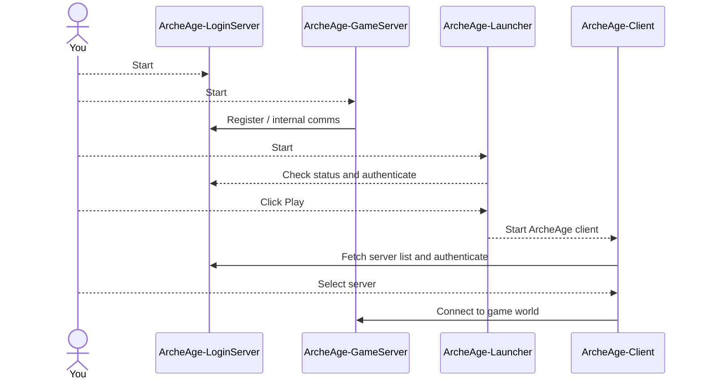

# Understanding AAEmu Components

- Audience: Contributors, players, and testers
- Last verified against: `develop` on February 28, 2026
- Prerequisites: None

Understanding the project components makes setup and debugging much easier.

## Data components

### ArcheAge reference database (SQLite, read-only)

This is the reference game data used by the server at startup.

### ArcheAge state database (MySQL, read/write)

This stores mutable game state.

It uses two schemas:

1. `aaemu_game`: world and character state.
1. `aaemu_login`: account/login state.

## Application components

### Aspire AppHost (optional orchestration)

Aspire AppHost is the preferred contributor workflow for local development.
It orchestrates MySQL, login server, and game server, and injects runtime
configuration through environment variables.

It does not replace login/game components. It orchestrates them.

### Login server

Handles authentication and server listing for clients.

Public login networking is ASP.NET Core Kestrel-based.

### Game server

Main world simulation process.
Uses reference data (SQLite) and mutable state (MySQL).

### Game launcher

Starts the ArcheAge client against a chosen login server.

### ArcheAge client

Playable client used for testing and gameplay.

AAEmu `develop` targets client 1.2 (`r208022`).

## How components interact

## Related

- [Home](Home)
- [Aspire Development Guide](Aspire-Development-Guide)
- [Installation & Setup](Installation-&-Setup)
- [Working with the Config.json files and server listings](Working-with-the-Config.json-files-and-server-listings)
